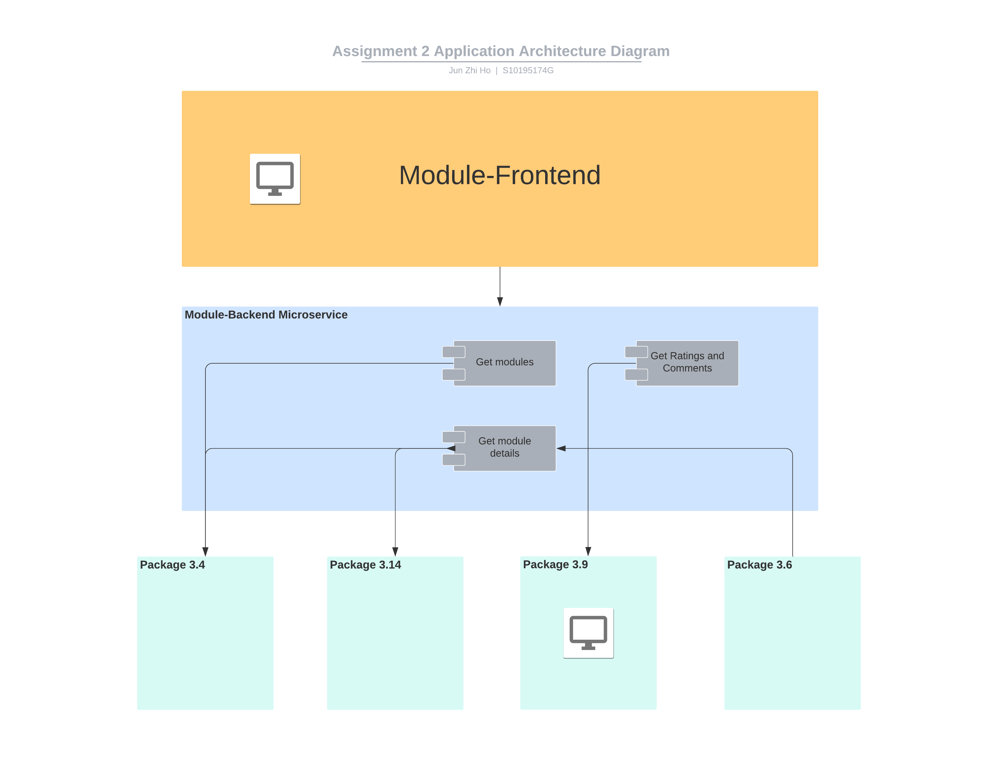

# ETI Assignment 2 Package 3.7 - Modules
Module Microservice for ETI Assignment 1 - by Ho Jun Zhi (S10195174G)
## Design Consideration of Microservices and Architecture
The design of the package consists of 1 microservices, excluding the frontend - the module-backend microservice and module-vue microservice.
The backend acts as a data access layer, communicating with other packages within Edu-Fi. The frontend communicates only with the backend to get the data it needs which is then displayed. 
Originally, the backend was omitted because package 3.7 could act as a frontend as it only had view funtionality. Additionally, no database was required as data could be directly accessed from other packages in Edu-Fi. However, as a microservice, additional functionalities could come about that would create the need for a database. Thus, the backend microservice was created - to allow for elasticity of the Module Package's features, as well as act as a anti-corruption layer.

## Architecture Diagram


## Link to container image
[Link to frontend docker image](https://hub.docker.com/repository/docker/h30jz07/module-vue)
[Link to backend docker image](https://hub.docker.com/repository/docker/h30jz07/module-backend)

## Module Microservice API Documentation
### [GET] /module/v1
Healthcheck.
Checks if backend is up and running.

Sample request
```
    curl http://10.31.11.12:9061/module/v1
```
Sample response
```
    Welcome to the Module API!
```

### [GET] /module/v1/modules/{:tutorId}
Get module details by tutor ID.
Retrieves modules that are taught by tutor.

Sample request
```
    curl http://10.31.11.12:9061/module/v1/modules/1
```
Sample response
```
[
    {
        "modulecode": "CM",
        "modulename": "Computing Math",
        "synopsis": "Learn Math",
        "learningobjective": "UNION INTERSEC",
        "classes": null,
        "assigned_tutors": [
            {
                "tutor_id": 1,
                "name": "Steve Jobs",
                "email": "Yumin@gmail.com",
                "descriptions": "rip",
                "modulecode": "CM",
                "moduleid": ""
            },
            {
                "tutor_id": 3,
                "name": "Wesley",
                "email": "Yumin@gmail.com",
                "descriptions": "This tutor is great",
                "modulecode": "CM",
                "moduleid": ""
            }
        ],
        "enrolled_students": null
    },
    {
        "modulecode": "ADB",
        "modulename": "Advanced Databases",
        "synopsis": "Learn Database Now",
        "learningobjective": "Configure MYSQL",
        "classes": [
            321,
            123,
            369
        ],
        "assigned_tutors": [
            {
                "tutor_id": 1,
                "name": "Steve Jobs",
                "email": "Yumin@gmail.com",
                "descriptions": "rip",
                "modulecode": "ADB",
                "moduleid": ""
            },
            {
                "tutor_id": 4,
                "name": "Wesley",
                "email": "Yumin@gmail.com",
                "descriptions": "This tutor is great",
                "modulecode": "ADB",
                "moduleid": ""
            }
        ],
        "enrolled_students": [
            {
                "student_id": "s102312132",
                "class_id": 321,
                "semester": "3"
            },
            {
                "student_id": "s101945183",
                "class_id": 123,
                "semester": "3"
            },
            {
                "student_id": "s112345676",
                "class_id": 369,
                "semester": "3"
            }
        ]
    }
]
```

## Instructions for setting up and running microservices
### Running on local
### Note: in local version, environment variables are explicitly set, and API endpoints are different to accomodate mock data.
1. Clone github repository. 
```
    git clone https://github.com/h30jz07/asg2-module.git
``` 
2. Checkout to commit for local testing.
```
    git checkout 62d8324e
``` 
3. Install npm dependencies for frontend.
```
    cd asg2-module/frontend
    npm install -g json-server
    npm i
```    
4. Run json-server for mock data.
```
    json-server --watch data/db.json -p9141
```
5. Open up a new terminal, then Run go backend.
```
    cd ../backend
    go run server.go
```    
6. Open up a new terminal, then Run vue frontend.
```
    cd ../frontend
    npm run serve
```    
You should be able to access the frontend through [localhost:8080](localhost:8080)!

### Running on T02 server
### Note: Not working on last test, due to CORS on other students' servers or APIs not up
1. Go into s10195174g folder
```
    cd s10195174g/asg2-module
```    
2. Pull latest git changes (Should not have any, but just to be sure)
```
    git pull
```    
3. Build docker compose
```
    docker-compose build
```    
4. Start docker containers
```
    docker-compose up -d
```
The frontend should be able to be accessed at [10.31.11.12:9060](10.31.11.12:9060).

The backend should be able to be accessed at [10.31.11.12:9061](10.31.11.12:9061/module/v1).
